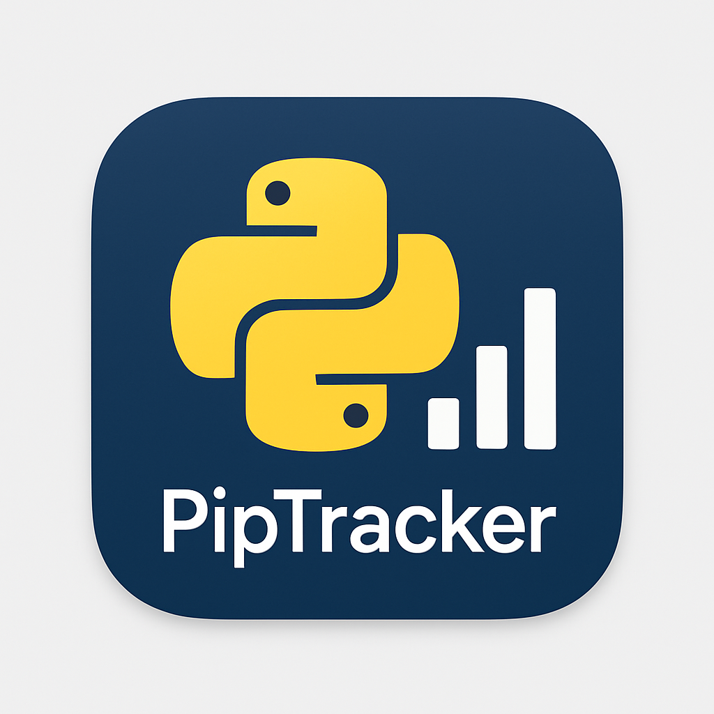
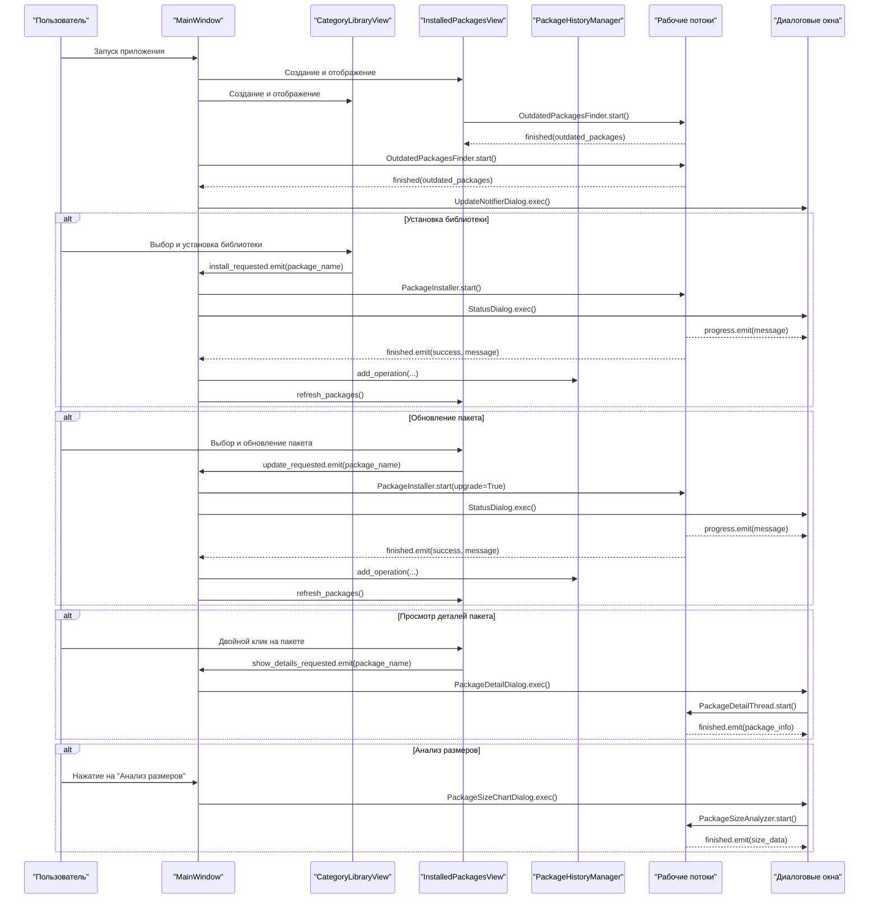

 # PipTracker - Менеджер библиотек Python



PipTracker - это графический менеджер Python-библиотек, разработанный на PyQt6. Приложение позволяет просматривать, устанавливать, обновлять и удалять Python-пакеты, а также предоставляет дополнительные функции, такие как категоризация библиотек, анализ размеров пакетов и отслеживание истории операций.

---

## Визуализация зависимостей (SVG)

> Ниже представлена SVG-диаграмма классов и связей (dependencies.svg):


---

## 1. Структура проекта

```
PipTracker/
├── pip_tracker.py          # Основной исполняемый файл с кодом приложения
├── category.JSON           # Файл с категориями и информацией о библиотеках
├── package_history.json    # Файл с историей операций над пакетами
├── PipTracker.ico          # Иконка приложения
└── dependencies.svg        # SVG-диаграмма классов и связей
```

## 2. Описание файлов

### pip_tracker.py

**Назначение**: Основной файл приложения, содержащий всю логику и классы интерфейса.

**Ключевые классы**:
- `MainWindow` - Главное окно приложения
- `CategoryLibraryView` - Представление библиотек по категориям
- `InstalledPackagesView` - Представление установленных пакетов
- `PackageHistoryManager` - Управление историей операций
- `StatusDialog` - Диалог отображения статуса операции
- `PackageHistoryDialog` - Диалог истории операций
- `PackageDetailDialog` - Диалог с подробной информацией о пакете
- `UpdateNotifierDialog` - Диалог уведомлений об обновлениях
- `PackageSizeChartDialog` - Диалог анализа размеров пакетов

**Потоки**:
- `PackageInstaller` - Поток для установки пакета
- `PackageUninstaller` - Поток для удаления пакета
- `OutdatedPackagesFinder` - Поток для поиска устаревших пакетов
- `BulkPackageUpdater` - Поток для массового обновления пакетов
- `PackageDetailThread` - Поток для получения подробной информации о пакете
- `PackageSizeAnalyzer` - Поток для анализа размеров пакетов

**Логика работы**: Файл реализует всю функциональность приложения через систему классов. Операции установки, удаления и обновления пакетов выполняются в отдельных потоках, чтобы не блокировать интерфейс пользователя. Результаты операций записываются в историю. Интерфейс разделен на две основные части: список установленных пакетов и каталог библиотек по категориям.

### category.JSON

**Назначение**: Хранит информацию о библиотеках Python, разделенных по категориям.

**Структура**: Файл содержит JSON-объект с массивом категорий, каждая из которых включает:
- Название категории
- Список библиотек с параметрами:
  - Название библиотеки
  - Название пакета для установки
  - Уровень активности (1-5)
  - Простота использования (1-5)
  - Размер (light, medium, large, etc.)
  - Тип поддержки

**Логика работы**: Данные из этого файла загружаются в `CategoryLibraryView` для отображения библиотек, разделенных по категориям. Пользователь может выбирать категорию из выпадающего списка и устанавливать нужные библиотеки.

### package_history.json

**Назначение**: Хранит историю операций с пакетами (установка, удаление, обновление, откат).

**Структура**: Файл содержит JSON-объект с массивом операций, для каждой из которых хранятся:
- Временная метка
- Дата в читаемом формате
- Тип операции
- Название пакета
- Версия
- Успешность операции
- Подробности операции

**Логика работы**: Данные из этого файла используются классом `PackageHistoryManager` для отслеживания истории операций и предоставления возможности отката изменений.

### PipTracker.ico

**Назначение**: Иконка приложения, используемая для отображения в панели задач и заголовках окон.

## 3. Архитектура проекта

### Общая структура

PipTracker построен на основе архитектуры Model-View-Controller (MVC), адаптированной для PyQt:
- Модель: классы для работы с данными (`PackageHistoryManager`)
- Представление: классы UI (`MainWindow`, диалоги, представления)
- Контроллер: логика в основных классах UI и рабочих потоках

### Диаграмма последовательности




### Потоки данных

1. **Загрузка данных**:
   - Данные о категориях и библиотеках загружаются из `category.JSON`
   - История операций загружается из `package_history.json`
   - Информация об установленных пакетах получается через `pkg_resources.working_set`
   - Информация об устаревших пакетах получается через вызов `pip list --outdated`

2. **Операции с пакетами**:
   - Установка/обновление/удаление пакетов через `subprocess` с вызовом pip
   - Результаты операций сохраняются в историю

3. **Визуализация данных**:
   - Данные о размере пакетов визуализируются через matplotlib
   - Детальная информация о пакетах получается через `pip show`

## 4. Библиотеки/фреймворки

### PyQt6
**Назначение**: Основной фреймворк для создания графического интерфейса
**Где используется**: Все классы UI (MainWindow, диалоги, представления)

### Matplotlib
**Назначение**: Библиотека для построения графиков и диаграмм
**Где используется**: `PackageSizeChartDialog` для визуализации размеров пакетов

### pkg_resources
**Назначение**: Доступ к установленным пакетам Python
**Где используется**: `InstalledPackagesView`, получение списка установленных пакетов

### subprocess
**Назначение**: Запуск внешних процессов
**Где используется**: Все рабочие потоки для вызова pip

### json
**Назначение**: Работа с данными в формате JSON
**Где используется**: `CategoryLibraryView`, `PackageHistoryManager`

### datetime
**Назначение**: Работа с датой и временем
**Где используется**: `PackageHistoryManager` для логирования времени операций

### os
**Назначение**: Работа с файловой системой и путями
**Где используется**: `PackageSizeAnalyzer`, `main()` для получения путей

### sys
**Назначение**: Доступ к системным функциям Python
**Где используется**: `main()` для инициализации приложения и выхода

## 5. Точка входа и запуск

### Как запускается проект
Проект запускается выполнением файла `pip_tracker.py`:
```bash
python pip_tracker.py
```

### Что выполняется первым
1. Функция `main()`:
   - Создает экземпляр `QApplication`
   - Загружает иконку приложения
   - Устанавливает константы для QMessageBox
   - Создает экземпляр `MainWindow`
   - Отображает главное окно
   - Запускает главный цикл обработки событий

2. В конструкторе `MainWindow`:
   - Инициализируется интерфейс
   - Создаются представления для установленных пакетов и категорий библиотек
   - Устанавливаются обработчики сигналов
   - Вызывается `check_updates_on_startup()` для проверки наличия обновлений

## 6. Архитектурные особенности

### Нестандартные решения
1. **Многопоточность**: Все длительные операции (установка, удаление, обновление пакетов, анализ размеров) выполняются в отдельных потоках, чтобы не блокировать интерфейс пользователя.

2. **Механизм отката операций**: Приложение поддерживает возможность отката операций установки, удаления и обновления пакетов, что нетипично для подобных менеджеров пакетов.

3. **Анализ размеров пакетов**: Приложение предоставляет функциональность визуального анализа размеров установленных пакетов с построением диаграмм.

4. **Оценка риска обновления**: При проверке наличия обновлений анализируется разница в версиях для оценки потенциального риска обновления.

### Причины выбора архитектуры
1. **PyQt6**: Выбран за современный интерфейс, хорошую документацию и кроссплатформенность.

2. **Отдельные потоки для операций**: Позволяют избежать "заморозки" интерфейса во время длительных операций.

3. **Сигналы и слоты**: Архитектура PyQt на основе сигналов и слотов позволяет легко организовать взаимодействие между компонентами приложения.

4. **JSON для хранения данных**: Простой и читаемый формат для хранения как каталога библиотек, так и истории операций.

5. **Разделение UI на компоненты**: Улучшает модульность и поддерживаемость кода.

6. **Локализация на русский язык**: Все элементы интерфейса и сообщения реализованы на русском языке для удобства русскоязычных пользователей.

7. **Визуализация с использованием matplotlib**: Предоставляет гибкие возможности для создания различных типов диаграмм.
